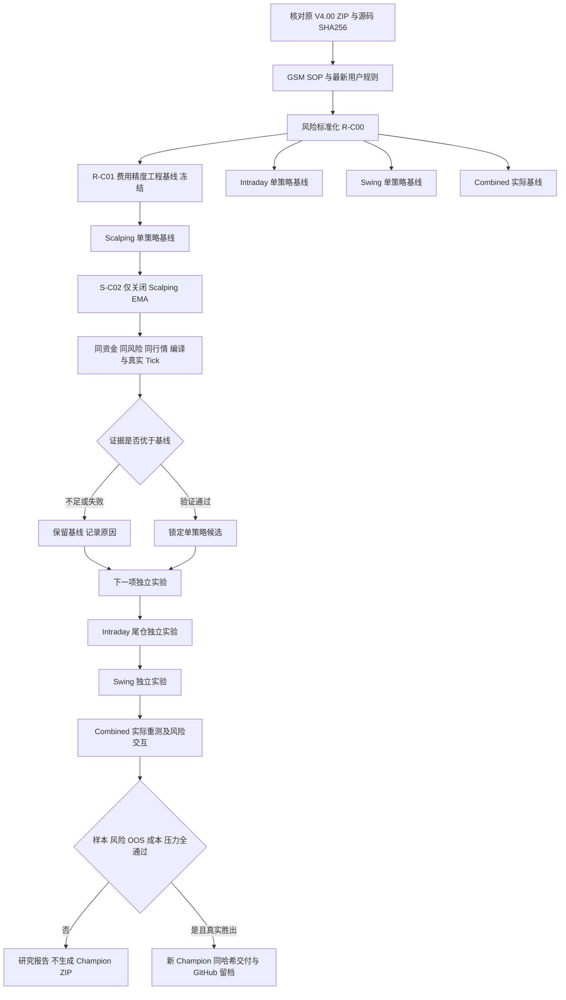
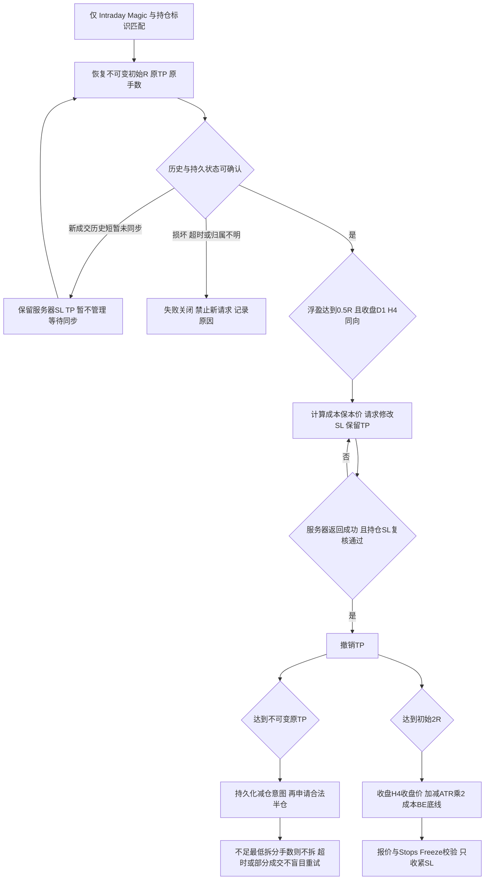

# FxPro 三策略研究流程

状态：研究中，未晋级 Champion，禁止实盘账户。

## 每次信号的执行顺序

三个引擎分别运行，不是三个同时满足才下单。

`引擎开关 -> 本策略 SOP -> 独立信号去重 -> 原技术过滤 -> 新闻/时段/点差 -> 初始SL/TP -> 计算每手止损风险及费用缓冲 -> 读取初始风险占用 -> 按1%/3%预算向下计算手数 -> 最低手数校验 -> 保证金/OrderCheck -> 新报价复核风险 -> 下单 -> Retcode/Deal确认 -> 持仓归属及统计`

最低手数超预算是本地跳过，不算券商拒单；不能伪报为无信号。
后台日志记录完整漏斗。停止或断线不能更新追踪止损，服务器确认的 SL 仍有效。

## 利润保护权限

| 引擎 | R-C00 当前状态 | 后续已授权实验 |
|---|---|---|
| Scalping | 固定 SL/TP；保护函数无操作，开启保本参数则初始化拒绝 | 不增加利润保护 |
| Intraday | 原进场与管理保留 | 0.5R且收盘D1/H4同向，先确认成本保本，再撤TP；原TP价合法平约50%；2R后收盘H4/ATR×2追踪 |
| Swing | 原D1/H4框架与原保护保留 | 审计低交易数与回吐后单独优化 |

Intraday 尾仓已实现为独立开关，真实 Tick 与故障测试结果见本轮研究报告；实现不代表获批。
0.01手不能合法拆分时不加手数、不分仓。初始R不可被移动止损重新定义。

## 验收口径

净利润 -> 最大净值回撤 -> PF -> 完整交易数 -> 胜率 -> 拒单。
DD>30%否决；15%-30%人工复核；净利润/最大净值回撤金额>3；每个引擎与组合均>100笔完整交易。
历史2026数据已经看过，后续重测均不是 untouched OOS。分批平仓不增加完整交易计数。
FxPro账户杠杆1:100，主资金2000USD；500USD为独立适配测试，不混入主资金成绩。

## 尾仓状态机

Scalping 不进入该管理器。保本价格不是无亏损保证，跳空、滑点、隔夜费仍可能造成损失。
